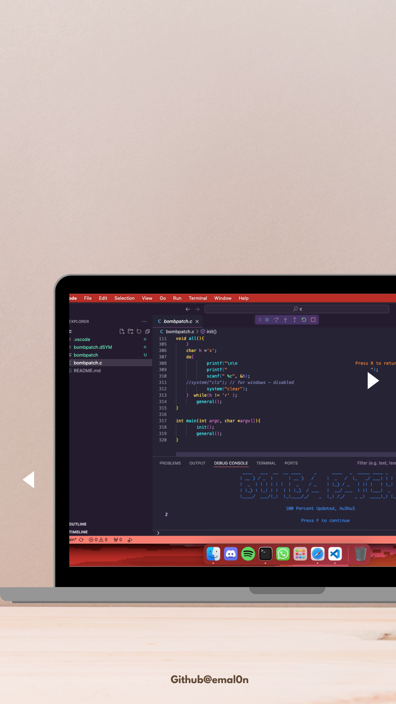

# ⚽ BombPatch - Football Tournament Simulator

[](https://www.cprogramming.com/)
[](LICENSE)
[](https://github.com/emal0n/bombpatch)
[](https://github.com/emal0n/bombpatch)
[](https://github.com/emal0n/bombpatch)

A comprehensive football tournament simulator written in pure C. Create your own 16-team tournament with group stages, knockout rounds, and a final match!



## 🚀 Features

- **16-Team Tournament**: Organize teams into 4 groups of 4 teams each
- **Group Stage**: Round-robin matches within each group
- **Knockout Stage**: Quarterfinals, semifinals, and final
- **Interactive Interface**: ASCII art and user-friendly menus
- **Tie Resolution**: Extra time and rematches for tied games
- **Statistics Tracking**: Goals scored, goals conceded, and victories
- **Cross-Platform**: Works on Linux, macOS, and Windows

## 📋 Requirements

- C Compiler (GCC, Clang, or MSVC)
- Terminal/Command Prompt
- Basic knowledge of football rules

## 🛠️ Installation & Compilation

### Using Make (Recommended)
```bash
# Clone the repository
git clone https://github.com/emal0n/bombpatch.git
cd bombpatch

# Build and run
make
make run
```

### Manual Compilation

#### Linux/macOS
```bash
gcc -Wall -Wextra -std=c99 -O2 -o bombpatch src/bombpatch.c
./bombpatch
```

#### Windows
```cmd
gcc -Wall -Wextra -std=c99 -O2 -o bombpatch.exe src/bombpatch.c
bombpatch.exe
```

### Debug Build
```bash
make debug
make run-debug
```

## 🎮 How to Play

1. **Start the Program**: Run the executable and press 'F' to continue
2. **Enter Team Names**: Input 16 team names when prompted
3. **Group Stage**: 
   - Enter goals for each match in all 4 groups
   - Handle ties with extra time if needed
4. **Knockout Stage**: 
   - Quarterfinals (8 teams)
   - Semifinals (4 teams) 
   - Final (2 teams)
5. **View Results**: Check team statistics and tournament results

## 📁 Project Structure

```
bombpatch/
├── src/
│   └── bombpatch.c      # Main source code
├── docs/
│   ├── INSTALL.md       # Installation guide
│   └── USAGE.md         # Usage instructions
├── assets/
│   └── raw/
│       └── photo.png    # Project logo
├── bombpatch            # Compiled executable (Linux/macOS)
├── bombpatch.exe        # Compiled executable (Windows)
├── bombpatch.dSYM/      # Debug symbols (macOS)
├── README.md            # This file
├── LICENSE              # MIT License
├── Makefile             # Build configuration
└── .gitignore           # Git ignore rules
```

## 🎯 Game Rules

The tournament follows standard football rules:
- 90-minute matches (simulated)
- Extra time for tied matches
- Rematches for tied group standings
- Goal difference and victories determine advancement

## 🏆 Tournament Format

1. **Group Stage**: 4 groups of 4 teams each
2. **Quarterfinals**: Top 2 teams from each group (8 teams)
3. **Semifinals**: 4 remaining teams
4. **Final**: 2 finalists compete for the championship

## 🎨 Features

- **ASCII Art Interface**: Beautiful terminal-based UI
- **Interactive Menus**: Easy navigation between options
- **Statistics Display**: Comprehensive team and match statistics
- **Rules & Information**: Built-in football rules and history
- **Credits**: Proper attribution for resources used

## 🛡️ Error Handling

- Input validation for team names and scores
- Tie resolution mechanisms
- Clear error messages and prompts
- Graceful program termination

## 📚 Menu Options

1. **New Match**: Start a new tournament
2. **Rules**: View football rules and regulations
3. **Font and Credits**: View ASCII art credits and sources
4. **About Football**: Learn about football history
5. **Exit**: Close the program

## 🤝 Contributing

Contributions are welcome! Please feel free to submit a Pull Request. For major changes, please open an issue first to discuss what you would like to change.

## 📄 License

This project is licensed under the MIT License - see the [LICENSE](LICENSE) file for details.

## 👨‍💻 Author

**Edmundo Neto (emalon)**
- GitHub: [@emal0n](https://github.com/emal0n)

## 🙏 Acknowledgments

- ASCII Art: [asciiart.eu](https://www.asciiart.eu/sports-and-outdoors/soccer)
- Football Rules: [rulesofsport.com](https://www.rulesofsport.com/sports/football.html)
- Football History: [britannica.com](https://www.britannica.com/sports/football-soccer)

## 📞 Support

If you encounter any issues or have questions, please open an issue on GitHub.

---

**Made with ❤️ and pure C**